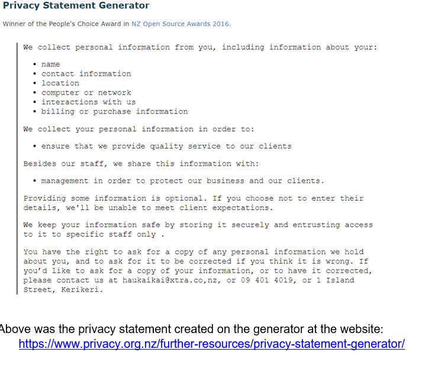
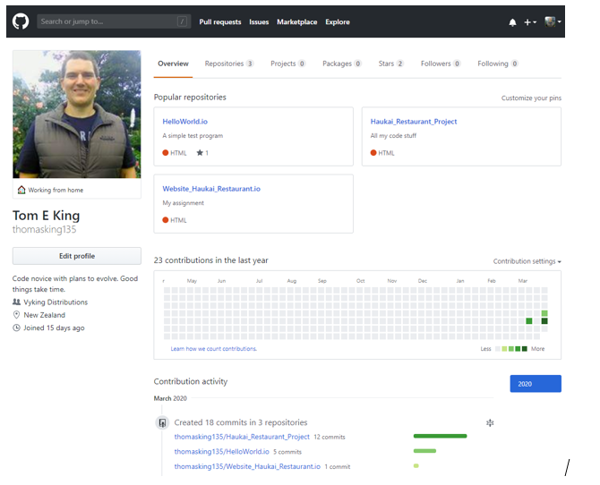
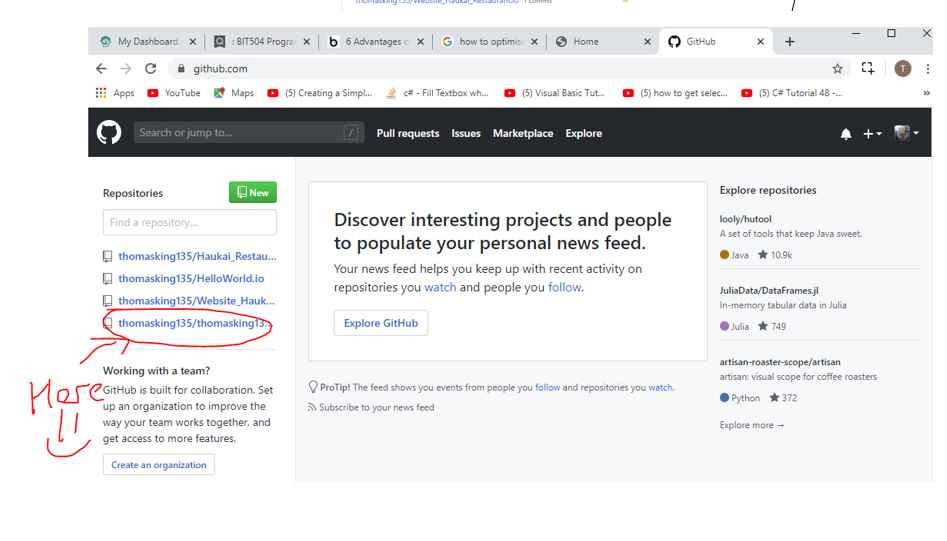
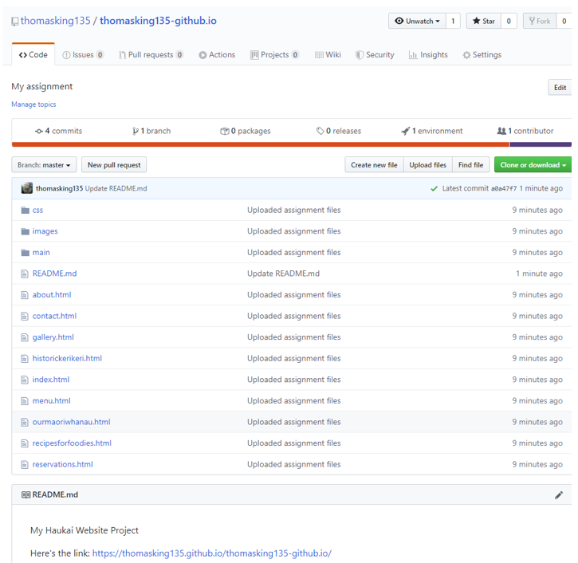
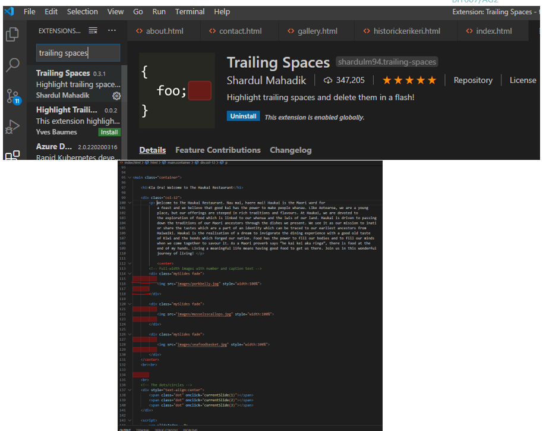
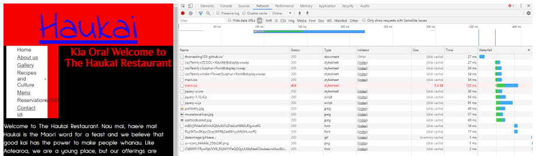

My Haukai Website Project

Here's the link: https://thomasking135.github.io/thomasking135-github.io/ 

My assignment

Part A

c. Accessibility Steps Taken

The Haukai Restaurant website I have created has attempted to integrate key usability elements into its design. 

A visual hierarchy has been established to ensure that key content desired by the business is clearly presented to the viewer of their website. The user is quickly able to have their attention drawn to key areas of the site which the business wishes to communicate (i.e. specials, location, hours etc).  

	The interface is simple, and the navigation is positioned in a clear way for the user to navigate around the site. There is a consistent layout throughout the site with pages being laid out in a similar manner. The colours are clear and inoffensive and allow the viewer to clearly read text and find information. Colour has been applied with the user in mind as well as to market the website and its product also. The primary colours of white, black and red are significant colours for the Maori of New Zealand. All text is highly legible. 

	Information is short and concise and there is adequate empty space around text and images to avoid overloading the user. Alt text has been included where possible to provide information about inserted images and other graphics. Clear headings are provided and highlighted so that users can clearly find the information they require, and links are provided back to the main/index page along with to other pages on the site to allow ease of access to desired content. In all, it is a basic but intuitive sight which will allow the user to discover the information they wish to know quickly and easily. 

	The site has also attempted to cater for mobile users and appears well on mobiles and tablets as well as on desktop personal computers. It has been tested on several key browsers and the response time for upload on all have genuinely delivered strong results. It appears to load smoothly on most of the major browsers it has been tested on. The content can be easily accessed using touchscreens or through the use of a keyboard alone. 

	Efforts have been taken to provide information that the services offered by the business are credible. Clear information about the restaurant’s services are provided including images and prices of many of their services. Contact information about the business is also supplied and site visitors can learn a bit about the individuals operating the business. This can greatly help to create piece of mind for shoppers. Certificates could also establish this credibility, and these are all key to putting people at ease whom may feel that the business might be a scam. 

	The site through its security protocol attempts to assure their clients that all information collected about them will be kept private and confidential and will not be abused for other purposes. 

	ARIA landmarks have been established for easier navigation and as landmark roles for identifying the content of each section within a page (i.e. the use of tags, nav, main, div, form etc). This helps to announce the start and end of each landmark on a web page. 

	The form itself has been designed for accessibility with clearly defined labels and clearly established groupings. It is facile to navigate around and lays out clear instructions for the user to follow. Submitting the form is a clear and easily identifiable process. 

	To create a site which is accessible for those with disabilities, strong colours have been used and descriptions of content have been provided where possible. The font has been set at a readable size. Images and links have been created at a larger clickable size to ensure clarity of choice and the text employed has kept simple for users with learning disabilities and for those whom do not want to be bombarded with overly wordy descriptions. Descriptions to links have also been supplied. 
  

d) Privacy Statement

e) Identify and discuss: 

•	The types of security issues that website designers should consider. Include this discussion in your README file.  
Some of issues worth considering are cross-site request forgery, security misconfiguration, insecure direct references and broken authentication and session management. 

1)	Cross site request is when an attack is launched into deceiving a user into taking an action which they did not mean to perform. Hacker’s target users by sending a request to an application where a user is already authenticated against. In sites of commercial dealings, this can provide the hacker with access to sensitive personal information. 

2)	Security misconfiguration is centred around the maintenance or lack of it in an application. An insecure configuration gives hackers access to private data and can result in the compromise of an application and its aim to keep data safe and confidential.

3)	Insecure direct object reference are files, databases, directories that expose a reference to an internal implementation object. Exposure of these allow a hacker to manipulate these references increasing their chances of accessing a user’s private data. 

4)	If authentication identifiers are not safeguarded, an attack can seize the identity of the user and use it for their own purposes. This is caused by broken authentication where user credentials are robbed before, during or after an online session time. 

These are just some of the many points web developers should take seriously. 

•	How HTTP caching and Content Delivery Networks could further improve responsiveness. Include your discussion in your README file.

Benefits of caching

The benefits of http caching are that they can contribute to the sites performance on the internet. It can achieve this through reducing the latency attached to accessing online documents. As the cache is closer to the user this should greatly reduce latency and raise the performance of web browsing.

Caching can also increase performance by decreasing the effort required by the remote web server. This is accomplished by data being spread evenly over a network. 

Caching can also provide robustness during times when a server might be down. Access to a cached copy at the proxy ensures that the web service is resilient during where remote servers are not operational or performing at a less than desirable standard.   

A major advantage of caching is that considerably decreases bandwith consumption significantly reducing network traffic congestion. This is important for users wanting video streaming, to play games or just to do online shopping. Increased performance contributes to an enhanced user experience. 

Benefits of CDN

The ideal of a strong CDN is to serve users with high availability and performance content online. The speed and delivery of a content is important to every user. 

CDN will decrease the load on your server enabling it to handle an increase of users. This is accomplished by spreading the content across several servers. 

CDN’s also seek to make the delivery of content faster. A cached site by a browser means that accessing material will be fast as the site does not have to be downloaded again. This also takes a lot of pressure of the networks and their loads.

Latency and packet loss are also improved through the CDN which improves the delivery of packets of information to the user. This greatly improves the definition of the content received contributing to increased user satisfaction. 

There are also invaluable storage and security advantages provided by CDNs. CDNs provide secure storage for content which is essential to meeting the needs of their users. CDNs can protect content and restrict access to it through user authentication.  

Part B

a) Use of Git Hub and Repository Screenshots

 

  
 

  
 
 b) Mobile Responsive Design Principles
 
 Steps which I have taken to make my application mobile friendly were vast. I attempted to compress images along with the CSS to ensure that loading speeds were swift for mobile users. I attempted to create a visually driven site which was dominated by more images and minimal but critical supporting textual information for users. The images were set to adjust to the size of the device and given the diversity of devices this was an important step taken. This ensured that users would not have to pinch the screen to zoom in and out of the site. The setting of images with percentages could also help to ensure a clear visual presentation on a variety of horizontal and vertical mobile devices. 

Key information was selected, and text was kept simple using largely standard fonts. Larger fonts were selected, and colours were tactfully selected to ensure legibility and accessibly to users whom may have selective disabilities or impairments. Alt text and descriptions were provided with links the sites were tested on several browsers and devices to see how they looked and performed. They generally performed sufficiently on most of the major browsers and appeared pleasing on most of the mobile devices I tested them on (my phablet, Smart Phone, tablet and laptop). The use of meta configuration would have been a safe and easy way to ensure the soundness of the viewpoint across multiple devices. The other option would have been to have built an application specifically for mobile use only (or a link to a mobile created site from a desktop created site).

Ease of clicking texts were conducted across my devices and efforts were taken to make clickable links large and easy to click on. At the same time, I tried to reduce the integration of plugins such as Flash to ensure that performance was upheld on all devices, especially mobiles. The site briefly took into consideration landscape and portrait viewing modes and I personally felt that while these could have been improved (perhaps with Media queries), I was largely pleased with how they appeared overall on many of the mobile devices and browsers they were trialled on. Greater testing on mobile screen resolution could greatly have been integrated into my project.

The layout of the site was kept simple to deal with the mobile user in mind and their desire to find what they want quickly. Access to the menu and to all pages can be clearly found in the navigation bar and users can quickly navigate back to the home page or other pages as they wish. Appropriate headings have been used to compartmentalise information accordingly further assisting users to find what they are looking for quickly and efficiently.

The SEO is something that could have been improved. 

 
 c) Trailing Spaces shots
 
 

  
 
 d) Web page speed optimisation screen shot
 
 

 
The primary ways I have attempted to improve the loading times of my web pages is through proper formatting and the optimisation of graphic images. All images have been compressed using Tiny PNG. I’ve tried to avoid the insertion of inline JS and CSS code into the pages of my site and I have tried to create a simple functional CSS page. The use a CDN for delivering static assets can also improve loading times for a website. I have tried to get all pages to load at an ideal 2 seconds and no longer than 3 seconds given the tendency of user interests in a site to increasingly fall with poor performing and slow to upload websites. 
speeds. 

